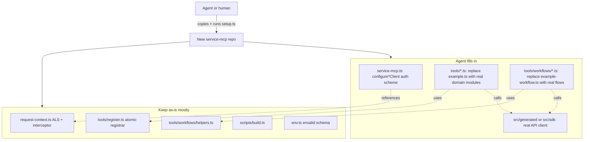

# MCP server template

Self-contained scaffold for a TypeScript MCP server that wraps a REST API.
Mirrors the architecture of [ashby-mcp](../README.md): stdio + streamable HTTP
transports, multi-tenant credentials via `AsyncLocalStorage`, atomic + workflow
tool registrars, env-gated debug logging.

This is the **starting point** for a new agent. Run the rename, swap in a real
SDK, replace the two example tools, and you have a working server.

## Quick start

```bash
cp -r template ../my-service-mcp
cd ../my-service-mcp
bun setup.ts \
  --kebab my-service \
  --pascal MyService \
  --upper MY_SERVICE \
  --title "My Service"

bun install
bun run lint
bun run typecheck
bun run build
```

`setup.ts` rewrites every file and renames every path that contains a
placeholder, then deletes itself. Run it with `--dry-run` first to see what
would change.

## Placeholder tokens

| Token                  | Example        | Used in                                                                   |
| ---------------------- | -------------- | ------------------------------------------------------------------------- |
| `__SERVICE_KEBAB__`    | `my-service`   | File names, package name, CLI binary, symbol prefixes in a few helpers.  |
| `__SERVICE_PASCAL__`   | `MyService`    | Type and function names: `configureMyServiceClient`, etc.                |
| `__SERVICE_UPPER__`    | `MY_SERVICE`   | Env var prefix: `MY_SERVICE_API_KEY`, `MY_SERVICE_API_KEY_HEADER`, etc.  |
| `__SERVICE_TITLE__`    | `My Service`   | Free-form display name in README and tool descriptions.                  |

All four appear in both file contents and file names. `setup.ts` handles
both; if you prefer to do it manually:

```bash
# contents
rg --files-with-matches __SERVICE_KEBAB__ | xargs sed -i '' 's/__SERVICE_KEBAB__/my-service/g'
rg --files-with-matches __SERVICE_PASCAL__ | xargs sed -i '' 's/__SERVICE_PASCAL__/MyService/g'
rg --files-with-matches __SERVICE_UPPER__ | xargs sed -i '' 's/__SERVICE_UPPER__/MY_SERVICE/g'
rg --files-with-matches __SERVICE_TITLE__ | xargs sed -i '' 's/__SERVICE_TITLE__/My Service/g'

# paths (run twice to catch directories after files)
find . -name '*__SERVICE_KEBAB__*' | while read p; do
  mv "$p" "${p//__SERVICE_KEBAB__/my-service}"
done
```

## Architecture



## What you must implement

1. **Plug in a real SDK.** The template ships `src/client.ts` as a stub. Two
   options:
   - **OpenAPI codegen (recommended).** Add the generator as a dev dep and a
     config — see the Ashby project's [openapi-ts.config.ts](../openapi-ts.config.ts):

     ```bash
     bun add -d @hey-api/openapi-ts
     ```

     ```typescript
     // openapi-ts.config.ts
     import { defineConfig } from "@hey-api/openapi-ts";
     export default defineConfig({
       input: "./openapi.json",
       output: { path: "./src/generated", clean: true },
       plugins: [
         { name: "@hey-api/client-ky", baseUrl: "https://api.example.com" },
         "@hey-api/schemas",
         { name: "@hey-api/transformers", dates: true, bigInt: false },
         { name: "@hey-api/typescript", enums: "javascript", comments: true },
         {
           name: "@hey-api/sdk",
           transformer: true,
           comments: true,
           validator: { request: "zod" },
         },
       ],
     });
     ```

     Run `bunx openapi-ts`, delete `src/client.ts`, and update the import in
     `src/<service>-request-context.ts` to `./generated/client.gen.ts`.
   - **Hand-written client.** Flesh out `src/client.ts` with real methods, or
     replace it with `src/sdk/*.ts` modules. Any shape works as long as the
     `sdkFn`s you pass to `register*Tool` match what you import.

2. **Pick the auth scheme.** `configure*Client` defaults to HTTP Basic with an
   empty password (API key in the username). See the `// AGENT TODO` comment in
   `src/<service>-mcp.ts` for Bearer, two-part secret, and custom-header
   variants. The `mcp-openapi-typescript-stack` skill's **Authentication**
   section has a decision table.

3. **Replace the example tool and workflow.**
   - `src/tools/example.ts` — one atomic wrapper with a stub SDK function. Swap
     for real domain modules (`src/tools/users.ts`, `src/tools/orders.ts`, …)
     and call each new `register*Tools` function from
     `register*Tools` in `src/<service>-mcp.ts`.
   - `src/tools/workflows/example-workflow.ts` — one composite tool. Use it as
     the shape reference for real workflows (name → id resolution, parallel
     fan-out, `summary` + `data` response).

4. **Adjust the success envelope if needed.** `register.ts` and
   `workflows/helpers.ts` assume `{ success: boolean, errors: string[], … }`.
   Edit the `is*Error` / `unwrapSdkResponse` / `callApi` logic if your API
   returns a different shape.

## What you can usually leave alone

- `src/<service>-request-context.ts` — ALS, per-request interceptor, strict
  tenant 401 wrapper. **The `options.headers` fix inside the interceptor is
  load-bearing for multi-tenant HTTP with `@hey-api/client-ky`; don't drop it.**
- `src/tools/register.ts` — Zod → `inputSchema` extraction, BigInt
  sanitization, error mapping. Only the `is*Error` helper typically changes.
- `src/tools/workflows/helpers.ts` — `callApi`, `callApiAll`, response
  builders. Again, only the envelope assumption usually changes.
- `scripts/build.ts` — dual-bundle + hand-rolled `.d.ts` tail. Update the
  declaration file if you add new public library exports.

## Optional add-ons (not shipped in the template)

### Cloudflare Workers / edge runtime

Follow the ashby pattern in [src/worker.ts](../src/worker.ts): minimal
module-level code (install interceptor, set empty base config), then
**dynamic-import** the library inside `fetch` so generated Zod schemas don't
blow past the startup CPU budget. Create a fresh `McpServer` + stateless
transport per request — `Protocol.connect()` is one-shot.

### Direct CLI (non-MCP)

A shell-friendly binary that runs the same tool logic without an LLM. See the
plan at
[.cursor/plans/direct_cli_for_ashby_66d8dc3c.plan.md](../.cursor/plans/direct_cli_for_ashby_66d8dc3c.plan.md)
— the same "tool registry as side-effect" pattern ports directly.

### Docker multi-tenant deployment

Add a Dockerfile that runs `bun dist/cli.js --http --multi-tenant`. The image
has no secrets; each request sends its own key in
`X-__SERVICE_PASCAL__-Api-Key`. Enable `__SERVICE_UPPER___MCP_DEBUG_HTTP_AUTH=true`
via `-e` when debugging gateway/proxy setups.

## Verification checklist

After `setup.ts` and `bun install`:

- [ ] `bun run lint` passes.
- [ ] `bun run typecheck` passes.
- [ ] `bun run build` emits `dist/<service>-mcp.js`, `dist/cli.js`,
      `dist/<service>-mcp.d.ts`.
- [ ] `<UPPER>_API_KEY=test bun src/cli.ts` boots the stdio server and logs
      `"<Title> MCP server running via stdio"` to stderr.
- [ ] `bun src/cli.ts --http --multi-tenant` boots and returns `401` for a
      request without the configured API-key header:

      ```bash
      curl -s -o /dev/null -w '%{http_code}\n' \
        -X POST http://localhost:3000/ \
        -H 'Content-Type: application/json' \
        -d '{"jsonrpc":"2.0","id":1,"method":"tools/list"}'
      # → 401
      ```

## Related skills

- [`.claude/skills/mcp-builder`](../.claude/skills/mcp-builder/SKILL.md) — tool
  design patterns.
- [`.claude/skills/mcp-workflow-design`](../.claude/skills/mcp-workflow-design/SKILL.md) —
  composite workflow design.
- [`.agents/skills/mcp-openapi-typescript-stack`](../.agents/skills/mcp-openapi-typescript-stack/SKILL.md) —
  the abstract pattern this template concretizes. Read this before making
  non-trivial architectural changes to `<service>-mcp.ts` or
  `<service>-request-context.ts`.
